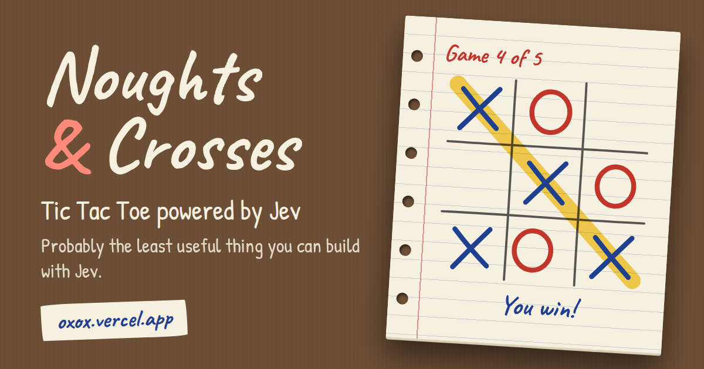

<div align="center">


# Noughts & Crosses

**Tic Tac Toe powered by [Jev](https://typesafe.ai). Play it, or play a friend.**<br />



</div>

## How Jev plays

Each turn the server sends Jev the board and asks one question: what is the best next move? It picks
from the empty cells, so it can never play an occupied square. If Jev is down, a minimax bot takes
over and the game tells you.

## Playing with a friend

Switch to Online, pick a name (8 characters max) and either hit Quick match or share an invite link.
There's chat, and a rematch when the match is over. If you refresh or your connection drops, you land
back in your game.

Rooms, the matchmaking queue and the live player count sit in Upstash Redis, so it doesn't matter
which WebSocket instance each player lands on. Without Upstash keys it all runs in memory, which is
fine for local dev.

## Run it

```sh
npm install
cp .env.example .env
npm run dev
```

## Deploy

Import the repo in [Vercel](https://vercel.com/new). The Vite preset is picked up automatically.
Online mode uses [WebSockets on Vercel Functions](https://vercel.com/docs/functions/websockets), so
you need Fluid compute (the default on new projects) and an Upstash Redis database.

| Variable                   | What for                                                    |
| -------------------------- | ----------------------------------------------------------- |
| `TYPESAFE_API_KEY`         | Jev's API key                                               |
| `UPSTASH_REDIS_REST_URL`   | Upstash Redis for Online mode. In-memory when unset         |
| `UPSTASH_REDIS_REST_TOKEN` | Upstash Redis token                                         |
| `SITE_URL`                 | Public URL for social cards. Only needed on a custom domain |
| `VITE_GA_MEASUREMENT_ID`   | Google Analytics 4. Off when unset                          |

## License

[MIT](LICENSE)
